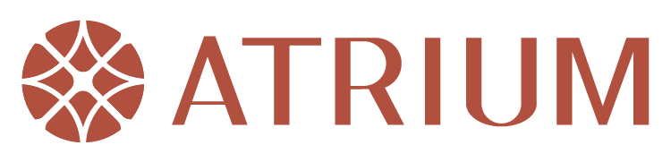

The [Archaeology Data Service](https://archaeologydataservice.ac.uk/) (ADS) is the leading accredited repository in the UK for archaeology and historic environment data. With over 25 years of experience the ADS supports research, learning and teaching with free, high quality and dependable digital resources.

## 👩‍🏫 Your instructors

**Dr Nicky Garland** [ 0000-0002-6789-0779](https://orcid.org/0000-0002-6789-0779)

Nicky is the Training and Communications Manager at the Archaeology Data Service (ADS). Nicky is an archaeologist with experience of teaching and training in both developer-led archaeology and academia.

Nicky is the course convenor for this Training School and the [contact](nicky.garland@york.ac.uk) for all of your questions.

**Dr Tim Evans** [ 0000-0002-2725-6730](https://orcid.org/0000-0002-2725-6730)

Tim is the Deputy Director of the ADS. Tim holds responsibility for all day-to-day operational issues at the ADS, and alongside our Director Prof Julian Richards is responsible for strategic development.

**Dr Holly Wright** [ 0000-0002-3403-4159](https://orcid.org/0000-0002-3403-4159)

Holly is the Research Projects Manager of the ADS. Holly manages and implements the ADS contribution to a range of major international research projects.

**Dr Émilie Pagé-Perron** [ 0000-0002-9878-9200](https://orcid.org/0000-0002-9878-9200)

Émilie is a Research Associate at the ADS. Émilie is the lead for metadata workflows as part of the ATRIUM project.

**Dr Sarah Middle**

Sarah is a Post-doctoral Research Associate at the ADS. Sarah provides research and project management support across major European cultural heritage infrastructure projects, including ARTEMIS, AUTOMATA and ECHOES.

**Dr Ewan Chipping**

Ewan is the HSDS Training Officer. He is responsible for designing and delivering training to users of the service.

### ATRIUM

Advancing FronTier Research In the Arts and hUManities ([ATRIUM](https://atrium-research.eu/)) is a European Commission funded project that aims to exploit and strengthen interconnections between leading European infrastructures: (DARIAH, ARIADNE, CLARIN, OPERAS) to improve access to a portfolio of state-of-the-art services available to researchers across countries, languages, domains and media. This project will build on a shared understanding and interoperability principles established in the SSHOC (Social Sciences & Humanities Open Cloud) cluster project and other previous collaborations.

For more information about ATRIUM please visit the [project website](https://atrium-research.eu/).

:::::: columns
::: {.column width="40%"}

:::

::: {.column width="20%"}
:::

::: {.column width="40%"}

:::
::::::
